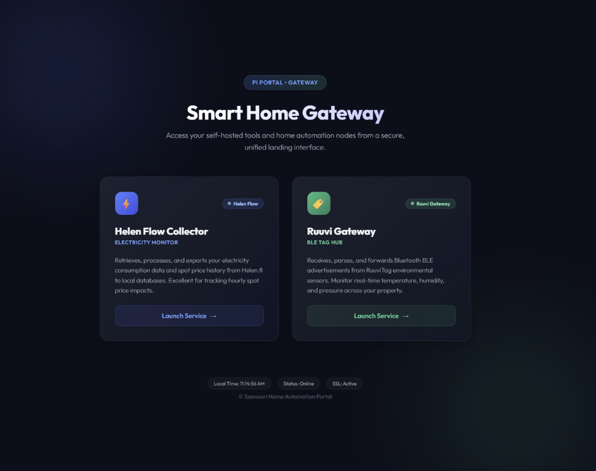

# Caddy Proxy for Raspberry Pi Services

This repository contains a containerized reverse proxy setup using **Caddy** to route multiple web applications (running in Docker or host mode) on a Raspberry Pi using subpath-based routing under a single dynamic DNS (DDNS) domain.



Features:
* **Automatic HTTPS**: Requests and automatically renews SSL/TLS certificates via Let's Encrypt / ZeroSSL.
* **Basic Authentication**: Password protection globally enforced across all proxied services.
* **Simplified Access**: Access all your services under a single domain (e.g., `https://your-domain.com/helendatacollector/`, `https://your-domain.com/ruuvigateway/`).

---

## Architecture

* **Caddy** runs in a Docker container connected to a shared bridge network `web-proxy` and exposes ports `80` (HTTP validation) and `443` (HTTPS).
* **Helen Flow Data Collector** runs in bridge mode on the same `web-proxy` network and is accessed via Caddy routing (`helen-collector:3000`).
* **RuuviGateway** runs in `host` mode (for BLE/Bluetooth functionality) and is accessed by Caddy routing to the host gateway (`host.docker.internal:8080`).

---

## Installation

Run this single command on your Raspberry Pi to download the installer, set up the directory, and configure the shared Docker network:

```bash
curl -fsSL https://raw.githubusercontent.com/Saavuori/caddy-proxy/main/install.sh | bash
```

This will install Caddy proxy files into a `./caddy-proxy` directory and create the `web-proxy` external Docker network automatically.

---

## Configuration

To finish deployment, configure the proxy settings:

### 1. Configure the Caddyfile
If you installed via the curl script, `Caddyfile` is already created from the template. Otherwise, if you cloned this repository, copy the example template:

```bash
cp Caddyfile.example Caddyfile
```

Open `Caddyfile` and configure your settings:

1. **Email Address**: Replace `your-email@example.com` with your email to receive Let's Encrypt certificate notifications.
2. **Domain name**: Replace `your-ddns-domain.tplinkdns.com` with your actual dynamic DNS domain.
3. **Basic Authentication Hash**:
   Generate a secure bcrypt password hash for Caddy using the following command (replace `YOUR_PASSWORD` with a secure password):
   ```bash
   docker run --rm caddy caddy hash-password --plaintext "YOUR_PASSWORD"
   ```
   Copy the generated hash and replace `YOUR_GENERATED_BCRYPT_HASH_HERE` under the `basic_auth` block in `Caddyfile`.

---

## Connecting Your Services

### Bridge Containers (e.g. Helen Flow)
For containers running in bridge mode on the same machine, modify their `docker-compose.yml` to connect to Caddy's network and declare it as external.

Example `docker-compose.yml` block:
```yaml
services:
  helen-collector:
    image: ghcr.io/saavuori/helen-data-collector:latest
    container_name: helen-collector
    restart: unless-stopped
    ports:
      - "3000:3000" # Optional: Can be removed to restrict access to proxy-only
    networks:
      - web-proxy
    # ...

networks:
  web-proxy:
    external: true
```

### Host Mode Containers (e.g. RuuviGateway)
For containers running in host network mode (`network_mode: "host"`), they bind directly to a port on the host (e.g., `:8080`). Caddy accesses them via the `host-gateway` bridge defined in `docker-compose.yml` (`host.docker.internal:8080`). No network changes are required for host mode containers.

---

## Deployment

1. Start the proxy stack:
   ```bash
   docker compose up -d
   ```
2. Caddy will automatically request SSL/TLS certificates and serve the web UI at `https://your-domain.com`.
3. Check status and logs:
   ```bash
   docker compose logs -f
   ```
